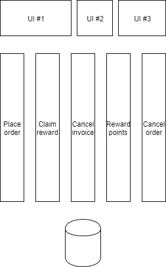

# Saving the unsaveable
How to survive the rewrite without losing all hope

---

## Disclaimer

_This is all probably very obvious_


+++
## My experience

- Worked at 4 widely different companies                    |
- Youngest codebase 6+ years                                |
- Weirdly similar problems                                  |
- Many well meaning developers over the years    |

Note:

---

## Life of a system

+++
### 1994

_Pre-web desktop client_

<!-- .slide: data-background-transition="none" -->


Note:
Just a thin client directly over a database.

+++
### 1999

_Web portal in ASP and VB6_


Note:
Web is not useful enough to do everything the desktop client does.

+++

### 2000

_Integrate with 3rd parties by using file exports_

<!-- .slide: data-background-transition="none" -->


Note:
Mixture of VBScript and scheduled tasks

+++
### 2002

_Rewrite web portal using ASP.NET and WebForms_

<!-- .slide: data-background-transition="none" -->


Note:
Still using VB though
Some clients remain due to very specific features
Web is pretending it can be useful enough

+++
### 2004

_We need more reports!_

<!-- .slide: data-background-transition="none" -->


Note:
SSRS and SSAS are added along with a Data Warehouse-database (a.k.a. the cube)
Somewhere, somehow a job is running each night to build "the cube"

+++
### 2005

_File integrations are upgraded to SSIS_

<!-- .slide: data-background-transition="none" -->


Note:
Not all jobs are migrated

+++
### 2005

_There are whispers of something called SOAP_

<!-- .slide: data-background-transition="none" -->


Note:
First mentions of a rewrite

+++
### 2007

_Rewrite of web portal in ASP.NET MVC_

<!-- .slide: data-background-transition="none" -->


Note:
90% of UI is just the old portal in an iframe
Sold to a bunch of customers as Next Generation

+++
### 2009

_Source Control is invented!_


Note:

+++
### 2010

_Yet another rewrite of web portal in MVC is started_


Note:

+++
### 2011

_We need to use SOA!_


Note:
A new database is created
New API is just a thin wrapper over the new database
Some attempts to re-use in desktop client

+++
### Late 2012

_New web portal is relased_


Note:
Only 40% completed

+++
### Christmas 2012

_Discovered new portal messes up statistics_


Note:
A new database sync agent is created to sync data from the new database to the old

+++
### Spring 2013

_Customers complain data updated in old portal is not visible in new portal_


Note:
The sync agent is updated to also sync data from the old database to the new

+++
### Spring 2013 + 1 weeks

_Database gets corrupted due to old data being synced is synced back again_


Note:
Database backup restored. One week of customer data lost.
Sync job is fixed
The code is a nightmare
This will become a scar in the organization

+++
### Spring 2013 + 2 weeks

_Management bans "rewrite" from corporate dictionary_


Note:
Executive decision is that migrating from old database is not an option


+++
### Spring 2013 + 3 weeks

_Developers start talking about refactoring_


Note:

+++
### 2015

_JSFotM-movement has gained momentum_


Note:
JavaScript Framework of the Month
Grunt, Gulp, Webpack
jQuery-Knockout-Angular-React

+++
### 2016

_We need to be Microservice-compliant_


Note:
Changing the database is still too much. Single integration database.

+++
### 2018

_You are hired to clean up this mess!_


Note:

---
#### What can a poor developer do?

- Toxic sentiments |
  - "We'll rewrite this code soon anyway" |
  - "This code is s**t anyway, just do a dirty hack" |
  - "Easier to rewrite it all" |

Note:
A change in attitude helps a lot
We need to not be indifferent

+++
#### What can a poor developer do?

> The only thing necessary for the triumph of evil is for good men to do nothing.
>
> _Edmund Burke_

---
## The rewrite fallacy

> "It would be easier to rewrite the entire thing than to continue working
> with the code as it is today"

+++
## The rewrite fallacy

> If you think you understand quantum mechanics, then you don't understand quantum mechanics.
>
> _Richard Feynman_

+++
## The rewrite fallacy

> The only true wisdom is knowing you know nothing.
>
> _Socrates_

+++
## The rewrite fallacy

- Software accumulates knowledge over time |
- All those quirks mattered at some point |
- Odds are nobody remembers why |

Note:
Need to figure out _every single one_ of those quirks up-front

---
## The rewrite pitfall

- The rewrite is granted!       |
- Developers rejoice!           |
- New git repository created    |
- The hacking starts            |

+++
## The rewrite pitfall

18 months of work. Implemented the exact same system, but used REST instead of SOAP.

---
## Avoiding the pitfall

- Don't kid yourself            |
- Think differently             |
  - how you write code          |
  - how your business operates  |
- Start small                   |

Note:
Pride goes before a fall

Businesses can assume that the way the system works is the only way it CAN work

---
## Thinking differently

> Those who cannot remember the past are condemned to repeat it
>
> George Santayana

+++
## Thinking differently

Tried and true


Note:
Just take a standard layered application and slap REST/SOAP on it.
Adding a feature means updating UI, Service, Data and DB
Must always be deployed together

+++
## Thinking differently

*_Warning_*: Don't create a data access service. 

Note:
It is not a small task
All systems will still be tied to the database
Added network latency and instability
Code will not improve
"Let's throw some SOAP/REST/GraphQL on it"

+++
## Thinking differently

Vertical pipes!


Note:
Solve many small problems separately.
Odds are we only need to fix and deploy a single part.

+++
## Thinking differently

Thin pipes!



Note:
The extreme end
Each use-case can (theoretically) use its own tech-stack

+++
## Thinking differently

Separate read and write


Note:
Reads inform user and enables them to decide what to do next
Writes enact a desired state change in the system
Allows us to just rewrite our write-logic

---
## Starting small

How do you find a good spot when everything is tangled together?


+++
## Starting small

Pick one thing the users can do today.

- Something that kinda works |
- Some code that just hurts to watch |
- Something you spend a long time fixing |

+++
## Starting small

Give it a name:

- Place order     |
- Cancel invoice  |
- Claim reward    |

Note:
Capturing the intent of the user
Intent need to be present in the code: PlaceOrder

+++
## Starting small

Analyze

- What system does it?    |
- What logic is vital?  | 
- What side-effects does it have? |
  - Sends an e-mail?  |
  - Creates an invoice? |

+++
## Starting small

Commands

- PlaceOrder     |
- CancelInvoice  |
- ClaimReward    |

+++
## Starting small

```csharp
public Changes Handle(PlaceOrder command)
{
  return Changes.Track(new OrderPlaced {
    OrderNumber = GenerateOrderNumber(),
    CustomerId = command.CustomerId,
    Items = command.Items
  });
} 
```

Note:
Ensure our code is focused on a specific task
Tracking desired changes instead of commiting straight to database is very powerful

+++
## Starting small

Logging

```csharp
public Changes Handle(PlaceOrder command)
{
  logger.Log("Placing order");

  var changes = next.Handle(command);

  foreach (var ev in changes)
  {
    logger.Log(ev.ToString());
  }

  return changes;
}

```

+++
## Staring small

Pipeline:

1. Authorize command
2. Log command
3. _Apply command_
4. Commit changes
5. On concurrency error, goto 3.
6. Log command result 
7. Perform side-effects

Note:
Every command can be treated equally
Write pipeline once only

+++
## Starting small

Side-effects:

```csharp
public Changes Handle(Changes changes)
{
  foreach(var ev in changes)
  {
    switch (ev)
    {
      case OrderPlaced e:
        SendReceipt(e);
        break;
    }
  }
}
```

+++
## Starting small

- Make sure every system writes using your new logic. |
- Rinse and repeat.

+++
## Starting small

Start grouping commands together

- Modify the same logical thing, e.g. order |
- Requires the same data to validate        |

Note:
Over time patterns will emerge
In DDD they are called Aggregates
Things which must be commited to the database as a whole

---
## The real problem


_The heart of every system_

Note:
We're still writing to one monolithic schema

+++
## The real problem

Why is a shared database so bad?

- Hard to ensure data is always correct       |
- Easy to unknowingly break other systems     |
- Hard to write and read from it efficiently  |

Note:
Microservices _demand_ that databases not be shared. Why?

Adding a NOT NULL-column to a table, with no DEFAULT

It is not possible to make a god-model of a business and expect it to fit
every use-case. 

+++
## The real problem

- Hard to separate while everybody reads |
- Bi-directional syncing is hard         |

Note:
We don't want to have to rewrite every consumer of the database in one sweep.
Thankfully, since we're taking care of writes, not bi-directional anymore.

+++

## The real problem

Pipeline, revisited

1. _Apply command_
2. Commit changes
3. On concurrency error, goto 1.
4. Perform side-effects


- What if our network fails after committing? |
- How do SQL-databases deal with this?        |

---
## Event Sourcing

The append-only log

- Write your intent in a log  |
- Replicate...                |

Note:
If a log entry is corrupt, it means the write
never finished and can be ignored.

+++
## Event Sourcing

The append-only log

- Databases already do it |
- File systems do it  |
- Version control systems do it |

- Why can't our apps do it? |

+++
## Event Sourcing

- Save each change (event) instead of state |
- A log of changes to an entity             |
- A global log of all changes               |

+++
## Event Sourcing


+++
## Event Sourcing


+++
## Event Sourcing

Available databases:

- EventStore (https://geteventstore.com) |
- NEventStore           |
- Apache Kafka(?)       |
- Simple SQL-table!     |

+++
## Event Sourcing

| SequenceId | StreamId | Version | Type        | Body    |
|------------|----------|---------|-------------|---------|
| 1          |1234      | 1       | OrderPlaced | ...json |
| 2          |2345      | 1       | OrderPlaced | ...json |
| 3          |2345      | 2       | Approved    | ...json |
| 4          |1234      | 2       | Cancelled   | ...json |

+++
## Event Sourcing

Writes:

- Read all events for #1234     |
- Apply each in order to Order  |
- Validate and raise events     |
- Try append at end of log      |

Note:
Keep a version of the Order to enable optimistic concurrency

+++
## Event Sourcing

Replication

- `SELECT TOP 10 * FROM Events WHERE SequenceId > @LastProcessedId`
- Run it in a thread |

+++
## Event Sourcing

Pipeline, revisited again

1. _Apply command_
2. Commit changes
3. On concurrency error, goto 1.
4. Log command result

Asynchronously:
5. Perform side-effects

+++
## Event Sourcing

Replicate to the old database!

+++
## Event Sourcing

Deterministic

- If we get it wrong:
  - Fix code
  - Reset @LastProcessedId to zero
  - Data is automatically fixed

+++
## Event Sourcing

Other benefits:

- Side-effects can be cleanly separated   |
- No more "Steps to reproduce"            |
- Migration easier (just replay the log)  |
- New read models can be created          |

+++
## Event Sourcing

Low risk

- Easy to go back to traditional DB |
- Just replay the log               |

+++
## Event Sourcing

Gotchas

- Eventual consistency                    |
- Separate projections from side-effects  |

